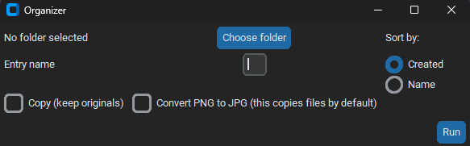

# File Organizer

A simple Python GUI tool for renaming, copying, and converting image files in bulk.

## Features

- Choose a source folder containing your files
- Rename files with a custom prefix and sequential numbering (e.g. `Bob1.png`, `Bob2.png`, ...)
- Sort files by creation date or by original filename before renaming
- Choose to either rename originals in place, or create renamed copies (keeping originals untouched)
- Optionally convert PNG images to JPG (strips metadata, e.g. AI generation prompts)

## Download

Download the latest `.exe` from the [Releases page](https://github.com/luboskollar/file-organizer/releases/tag/v1.0) - no Python installation required.
> **Note:** Windows may show a SmartScreen warning since this is an unsigned executable from an unknown publisher. Click "More info" → "Run anyway" to proceed.

## Usage

1. Click **Choose folder** and select the folder with your files
2. Enter a name prefix in **Entry name**
3. Choose a sort order (**Created** or **Name**)
4. Optionally check **Copy** (keeps originals) and/or **Convert PNG to JPG**
5. Click **Run**

## Screenshot

## Built with

- Python
- customtkinter (GUI)
- Pillow (image processing)
